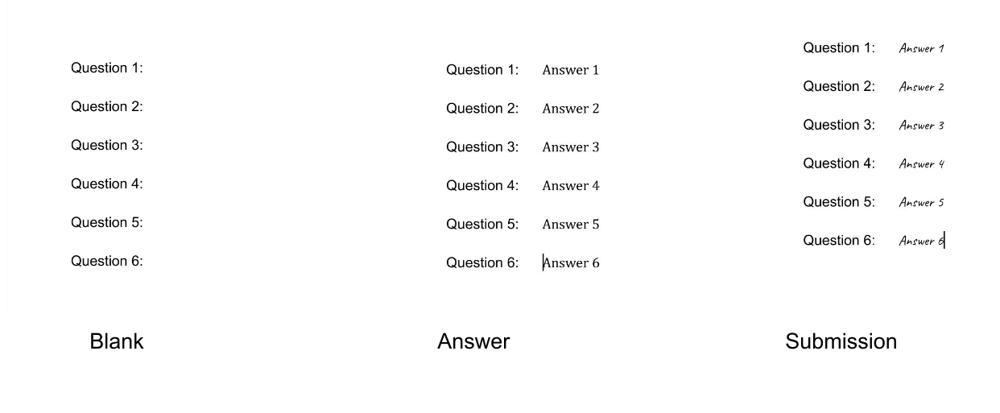
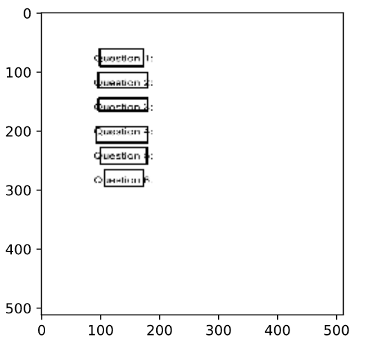
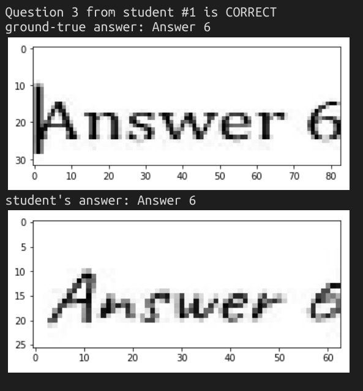
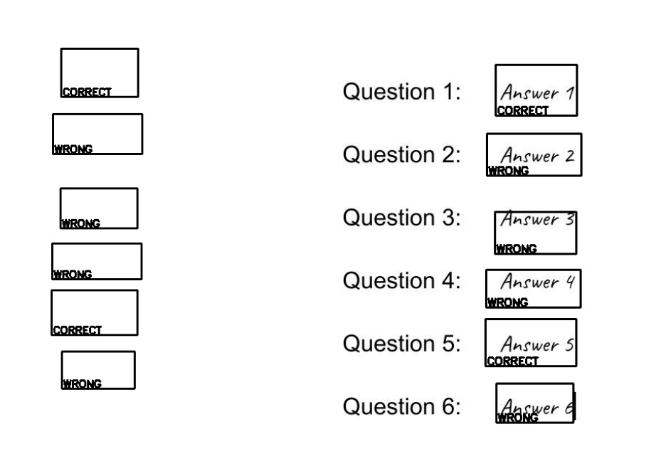

# AutoWorkHomeMatic

AutoWorkHomeMatic stands for "automatic homework". It is a tool designed for 
teachers to mark questions with specified answers, like multiple choice, with a 
scanner and a printer.  

This project is not completed and even the demo worksheet cannot be marked properly, 
since a pre-trained network for generic text detection is used here and no 
specialization have been done, due to time constrains and inadequacy of 
training datasets. However, it develops the concept that a teacher's work can be 
partially relieved with electronics, and it may also serve as a framework and will 
make great use as soon as proper networks are trained. 

## How it works

1. Using a scanner, fetch digital copies of a blank version of a worksheet, an
answer key, and all submissions from students. 

2. Scan through the blank worksheet with a 
[text detecting YOLO network](https://github.com/Neerajj9/Text-Detection-using-Yolo-Algorithm-in-keras-tensorflow)
to find out where are the questions. 



2. Cover questions on the answer sheet and submissions by drawing solid rectangle on
it, then scan them with the aforementioned YOLO network to get the positions of 
remaining texts. 



3. A piece of text found on answer sheet and another piece of text found on a 
submission sheet are answers for the same question, if they are about at the same
location, or having a high insertion over union ratio. 

4. For each pair of text from answer and submission sheet, convert them from image 
to strings, with the help of pytesseract. If the strings are equivalent then the
answer shall be considered as correct, else mark it as wrong. A “cannot determine” 
mode may also be added in the future, depending on specified requirements from 
schools. 



5. Encode previous outputs as image file and then instruct a printer to perform 
marking. 




## Get Started

### Download pre-trained model
The pre-trained weights `text_detect_weights.h5` should be located under .res/yolo/model. Download it manually either from [this github page](https://github.com/Neerajj9/Text-Detection-using-Yolo-Algorithm-in-keras-tensorflow), 
or you can find it in the releases of this repository.

### Install requirements 
```pip3 install -r requirements.txt```

### Run demo
Run `python3 main.py`.
Then images are generated under `./res/img/example1_out` and `./res/img/example1_verify`, where the formmer shall be printed on the submissions, while the latter serves as previews for printing. 
